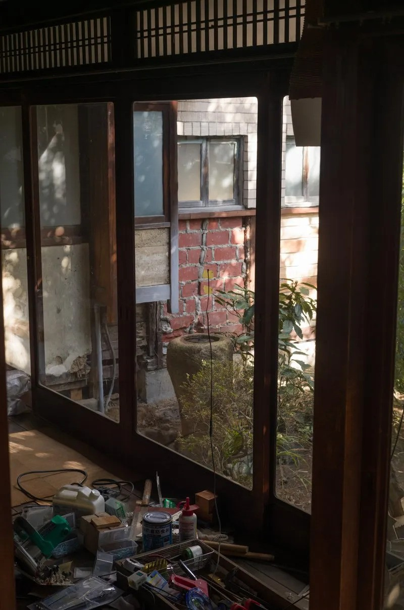
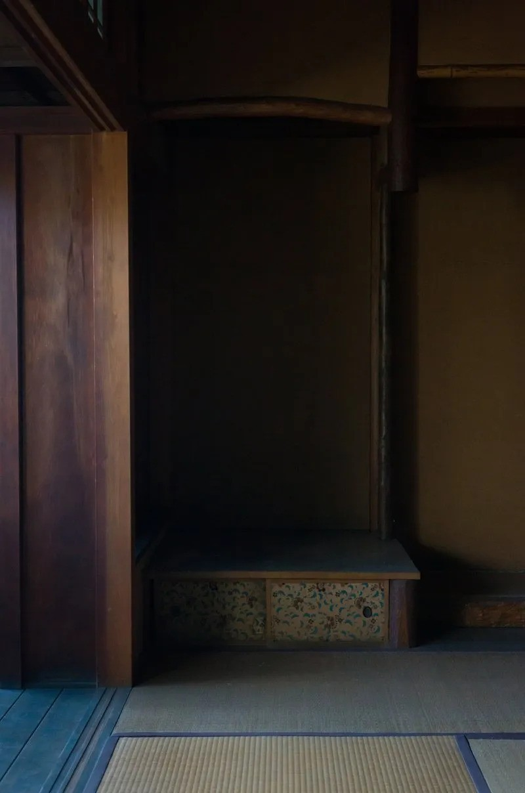
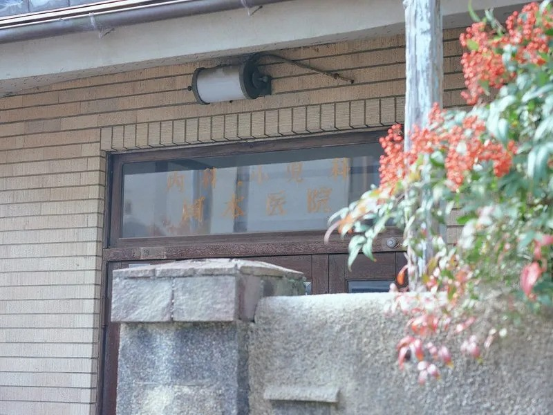
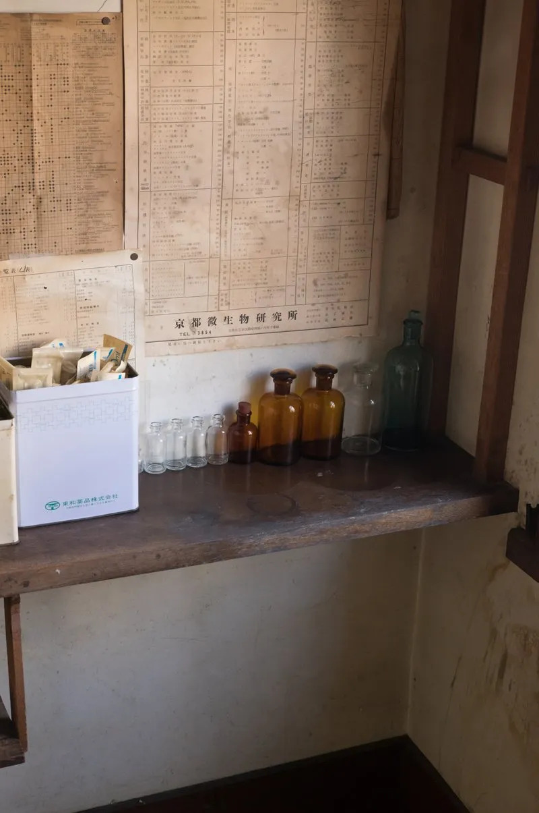
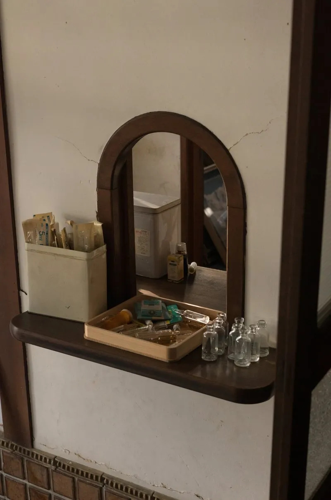
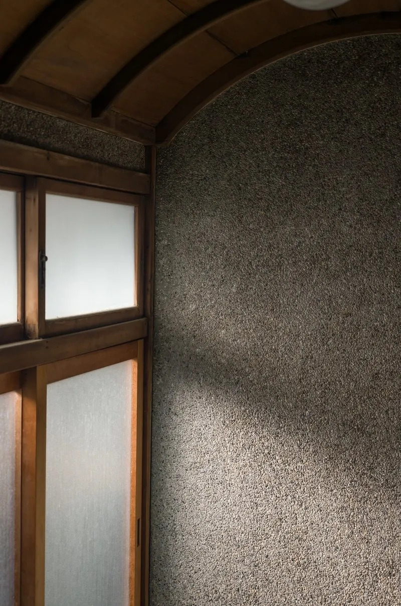
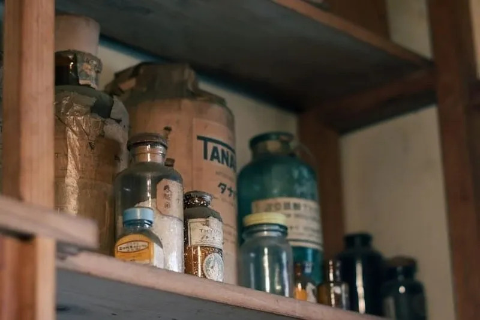
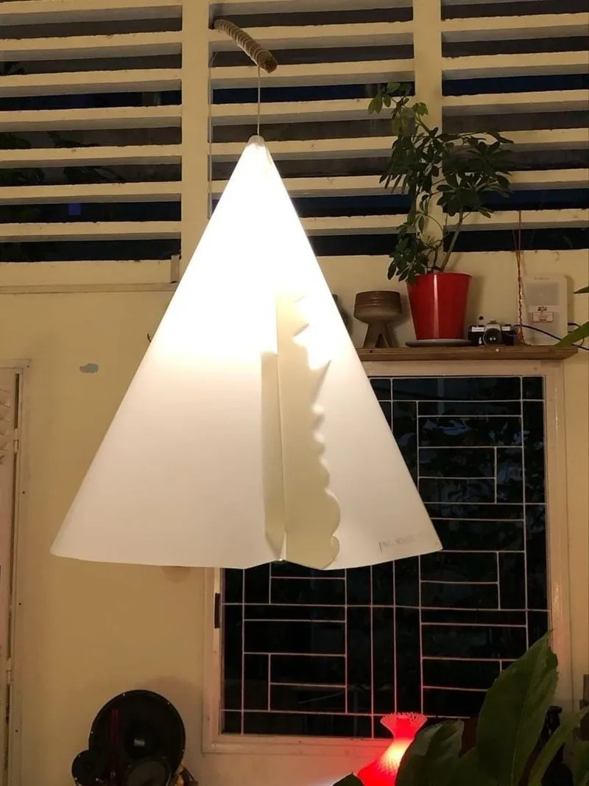

# The Aesthetics of “Miyo-Mimane” / Thoughts while Renovating a 1934 Former Pediatric Clinic

It’s been 6 months by now that I’ve started renovating a “western-style” house built in 1934, previously a pediatric clinic, located near Ginkakuji in the Jodoji are, Kyoto. From our home office, “[Bridge To](https://www.brdg.to/),” it’s just a 5-minute walk. We first noticed this grand, uninhabited Western-style house around five years ago. After a year of anticipation, I finally sent a letter to the owner in January last year, and received a call from them by April. It’s been a whirlwind year, and I’m surprised at how quickly things have moved. The house had been vacant for over 25 years, so I can’t help but think the building as well might be taken aback by the sudden influx of people.

I am omitting the details of the project here, since it's already written on our [Kickstarter page](https://www.kickstarter.com/projects/2041013782/renovating-a-historical-kyoto-building-as-an-art-center). Instead, I want to articulate my thoughts as I undertake daily cleaning, demolition, and repair work amidst the dust. I also want to properly archive the beautiful moments that emerge in between the grueling, seemingly never-ending renovation process.

Despite my exhaustion from unfamiliar physical labor on site, I realize I have been neglecting to archive and share our progress. But the space changes so quickly that I hurriedly snap photos, regretting letting the moments pass. I wonder if raising children feels similar to this.

_Among the collapsed toilet walls and chaotic toolboxes, this shot of the messiest angle in the building still seems beautiful. Is it because of the sunlight filtering through the trees, or the water basin? Luckily, visiting friends leave behind beautiful photos like souvenirs. Photo: Daiki Nakamori_

_When I’m in this building, I feel the delicacy of the light throughout the house. Depending on the time of day, each room presents a different face. It can appear calm, chilly, or cheerful — it’s a mystery. Photo: Daiki Nakamori_

As I repair deteriorated portions and undertake partial demolition, the first thing I realize is that this “Western-style house” is genuinely made of earth, wood, and bamboo — it’s a traditional Japanese house. It reveals earth when you scrape away a bit of the wall. Digging further, bamboo lattices are hidden inside. The exterior may look like a Western-style house, but the interior is entirely Japanese architecture. I think the carpenters of the time must have built it by observing and mimicking Western architecture.

In fact, when friends from the western part of the world visit and I call it a “Western Style Building,” most of them tilt their heads in confusion. The roof tiles make it look like a Japanese house, and the original green tiles that remain in some parts give it a Chinese feel. Even Japanese friends who have seen this building describe it as “kind of like a Western-style house,” adding vague words like “like” or “kind of” at the end.

Perhaps, by the official definition, it might not be a Western-style house. But it’s also not quite a typical Japanese house — it’s an interesting building that defies definition.

_When speaking to elderly residents who have lived in this area for a long time, many say they used to visit this internal medicine and pediatric clinic. I wish I could have visited such a stylish hospital. I particularly like the original signboard, which appears to be handwritten. Photo: Kawashima Katsumi_

Neither the result of a trained architect’s “genuine” creation, nor a shoddy copy-and-paste job, but a product of ingenuity born out of admiration and curiosity for the unknown. This building, built in 1934, embodies the comical beauty at the end of a process where things that didn’t exist here were somehow recreated with available materials and techniques. I see a recreation stemming from the mingling of cultures.

_Apparently, there used to be something called the “Kyoto Microbiology Research Institute” in Okazaki. I’ve left the medical posters scattered around the medicine room as they add a touch of the past. It’s interesting when English notes pop up from time to time. Photo: Daiki Nakamori_

_A small window at the front door, a remnant of the pediatric clinic. The arch shape cut into it is cute. I want to buy movie tickets, coffee, or train tickets here. Photo: Daiki Nakamori_

_The arch-shaped ceiling in the bathroom is extremely cute. Photo: Daiki Nakamori_

I’m currently most interested in architectural and design practices created informally, which blend cultures and originate from the so-called “Miyo-mimane” — watching and mimicking — a kind of practice often used in a negative context. These practices are born out of cross-cultural imagination and desire, coupled with a positive “misunderstanding.”

With the internet allowing us access to global information and increasing international exchange, it’s easy to encounter“real” things and become good at copying/imitating. But I like the “reinterpretation” and design practice in this era, where understanding is drastically insufficient.

_There are a lot of old medicine boxes. The old packagings are quite unique. They’re not something you can recklessly throw away, so they’re stored in boxes. To my dismay, there’s also medicine sleeping in the basement… Photo:satsuki_

_I feel like each graphic on these packages hides various stories. Photo: @satsuki_

Homi Jehangir Bhabha played a significant role in post-colonial studies. His concept of “hybridity” is overwhelmingly famous, but his discussion on imitation is also fascinating.

Bhabha says our act of imitating things is the product of a “nearly the same but not exactly the same” modification and reconstruction process. When people in colonized areas are forced to “properly” imitate (mimic) the culture of the colonizing country, Bhabha showed the potential for expressing themselves through “improper imitation,” that is, parodies of displacement and mockery. This connects to Mary Louise Pratt’s concept of a “contact zone” and its main phenomenon, transculturation, proposed in Imperial Eyes (1992).

I think this Western-style house, built in the Showa era with the modern West in mind, might be an improper imitation or a shifted imitation as mentioned here. It might be a creative act that starts from imitation.

_Looking at the German dictionary and English notes left from the original clinic, I am reminded again that what we now call “medicine” was a foreign concept. Photo:satsuki_

_In contrast, the majority of the building is comprised of very traditional Japanese-style rooms. Photo:satsuki_

When I visited Ho Chi Minh, Vietnam, I liked the interior of a café that is popular among young people, but I couldn’t quite pin down its style. Some friends described it as Shanghai French Concession style, while others said it was Chinese-Vietnamese style or “Neo-Vintage” Asia. The definition and memory are ambiguous. The one thing that can be said is that it is a product of a vague connection of multiple cultures — a creation of something not quite understood. I wonder if it was made by applying ingenuity to a longing for a world somewhere out there. My interest, which started from the “monkey see, monkey do” design practice of the early Showa era, is expanding to contemporary practices. In the era when we were imitating the West, what are we longing for now, what are we imitating, and how are we creating it? From there, I feel like we can understand a piece of the dynamics of the present age. Are we still longing for and imitating the modern West? Or has the direction of our admiration changed? How are we interpreting that longing, making it “our own,” and trying to recreate it?

_This lampshade, made by my friend Hieu who runs a space called NEM Space in Ho Chi Minh City, is a “fake” self-made version of a certain famous Japanese designer’s work. I was deeply moved by the strength to imitate and make an item that is very expensive and hard to obtain with the materials and skills at hand, and the new creativity that arises from it. I think this is the beauty of “Miyo-mimane”._

What I’m particularly interested in now are the connections, influences, and “imitation” relationships between non-Western regions such as within Asia, between Asia and Africa, and between Asia and South America. While continuing to think deeply about these topics amidst the dust and renovation, I want to keep my mind active as well as my hands. I want to be conscious about articulating and conveying the significance of the long process I’m currently undertaking.
