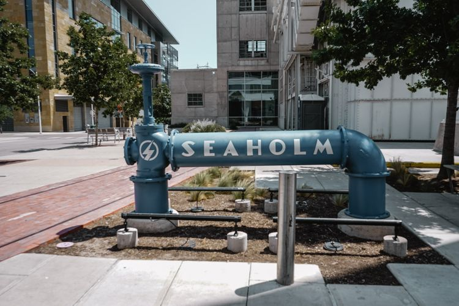

# Seaholm EcoDistrict - Austin's sustainable urban renewal

Seaholm EcoDistrict is an 85-acre urban development on the edge of downtown - it once used to be the city-owned power plant and a water treatment facility. After the power plant was decommissioned in 1989, a new public-private partnership was formed to renew this part of downtown by using green, sustainable design.

Seaholm EcoDistrict looks quite relaxed and surprisingly walkable (even within the heat!), with a vibrant hub of residential, office, and community gathering spaces.

It is quite interesting to see an environmentally Considerate project like Seaholm EcoDistrict in Texas, where car ownership and private property are close to a religion.

You can easily access there from the new central library (which also worth a visit) if you want to see how Austin's sustainable green urban renewal looks like. You can chill at one of their public chairs, or it's ok to charge your phone for free at one of the solar-panel installed benches.  

